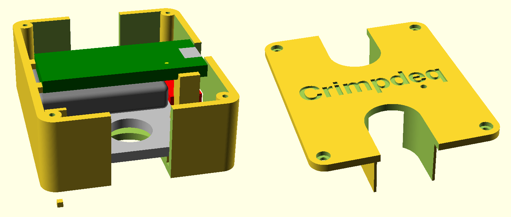

# 3D-Printed Case

The 3D case design is maintained in the [`crimpdeq-case` repository](https://github.com/crimpdeq/crimpdeq-case) and was created with OpenSCAD. It consists of two parts (main body and lid) and includes

