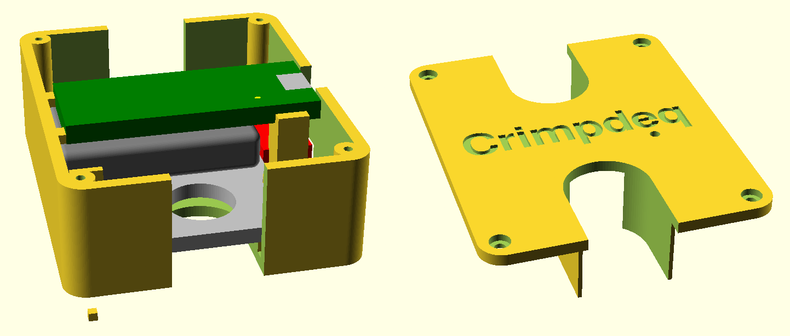

# 3D-Printed Case

The case design is maintained in the [`crimpdeq-case` repository](https://github.com/crimpdeq/crimpdeq-case) and was created with OpenSCAD.

It consists of two parts (main body and lid) and includes mounting points for the load cell, battery, PCB, and switch.

Download the printable files from the repository releases and choose a case version that matches your PCB revision. Print both parts before assembly.

