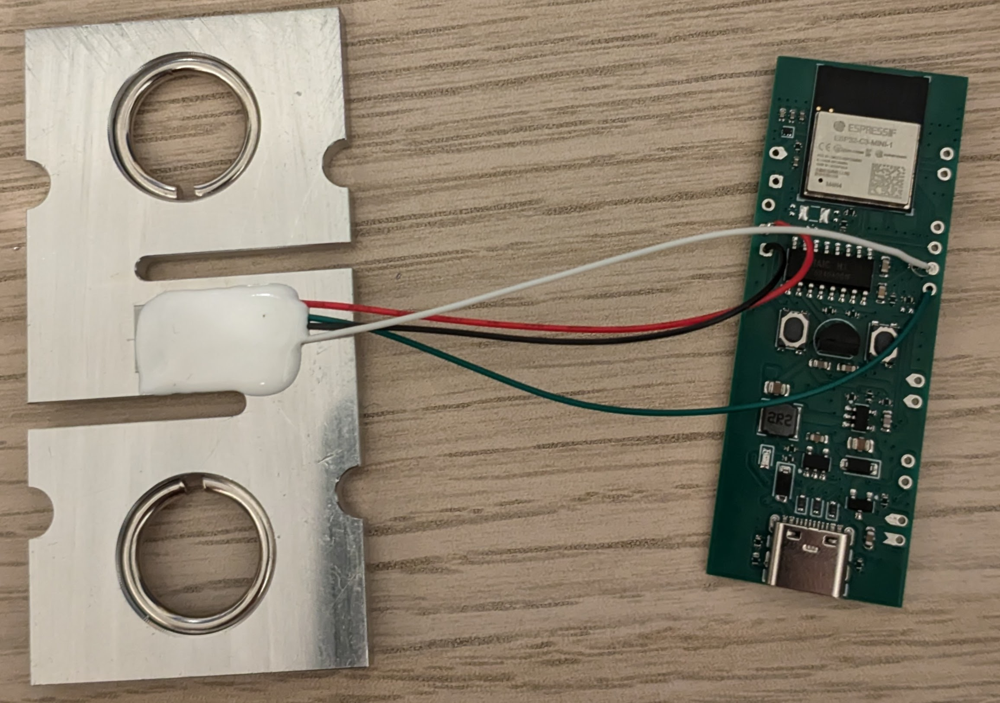

# Crimpdeq V1 Assembly

This chapter shows how to assemble your own Crimpdeq V1 using the custom PCB and 3D-printed case.

## 1. Required Materials
- [Crimpdeq PCB v1.0.0](https://github.com/crimpdeq/crimpdeq-pcb/releases/tag/v1.0.0)
- [Crimpdeq 3D case](https://github.com/crimpdeq/crimpdeq-case/releases/latest)
- Load cell: you can salvage one from a [crane scale](https://www.aliexpress.com/item/1005002719645426.html) ([Amazon alternative](https://www.amazon.es/dp/B08133JCM6)) or buy the load cell directly.
  - Use a WH-C07, or a compatible load cell with similar dimensions.
- [2000mAh battery](https://www.aliexpress.us/item/3256809404408618.html?spm=a2g0o.order_list.order_list_main.5.1406194d6kJ2h0&gatewayAdapt=glo2usa4itemAdapt)
- [KCD11 switch](https://www.aliexpress.us/item/2255800787248498.html?spm=a2g0o.order_list.order_list_main.11.1406194d6kJ2h0&gatewayAdapt=glo2usa4itemAdapt)
- 4 x M2.5 screws

## 2. Soldering
1. Connect the load cell to the PCB:
   - Solder the four load cell wires to the PCB: 

   | **PCB Pin** | **Load Cell Pin** | **Description**                    |
   | ----------- | ----------------- | ---------------------------------- |
   | E+ (15)     | E+ (Red)          | Excitation positive (to load cell) |
   | E- (14)     | E- (Black)        | Excitation negative (to load cell) |
   | S+ (12)     | S+ (Green)        | Signal positive (from load cell)   |
   | S- (13)     | S- (White)        | Signal negative (from load cell)   |

   > ⚠️ **Note**: This assumes the typical load cell wire colors (red = E+, black = E-, green = S+, white = S-). Verify your load cell wiring before soldering, because some compatible load cells use a different color order.

   

   <!-- To regenerate this image in KiCad: PCB Editor > File > Plot > select "F.Fab" > enable "Sketch pads on fabrication layers" and "Include pad numbers" > Plot. -->
   Reference photo of the load cell wires after soldering them to the PCB:

   

2. Install the load cell and battery in the case:
   1. Place the load cell in its position in the 3D-printed case.
   2. Route the load cell wires so they are not pinched by the PCB or the lid.
   3. Place the battery in the battery compartment.

3. Wire the battery and switch to the PCB:
   1. Solder the battery negative wire (black) to `B- (16)` on the PCB.
   2. Cut the battery positive wire (red) into two sections.
   3. Before soldering the switch, pass both positive wire sections through the switch opening in the case.
      - If you solder the wires to the switch first, you will not be able to insert the switch into the case afterward.
   4. Solder one positive wire section from the battery to one terminal of the KCD11 switch.
   5. Solder the other positive wire section from the second switch terminal to `B+ (17)` on the PCB.

   > ⚠️ **Note**: The switch must be wired in series with the battery positive line, and its OFF position must open the circuit. For safety, the battery should be disconnected from the PCB when the switch is off.
   
4. Place the PCB and switch:
   1. Position the PCB in the case.
   2. Tuck the wires neatly around it so nothing sits under the board.
   3. Insert the KCD11 switch into the switch opening.

5. Verify all connections with a multimeter.

## 3. Close the Case
1. Place the lid on the main enclosure.
2. Fasten it with the 4 M2.5 screws.

## 4. Next Steps
1. Flash the firmware (see [Firmware](../../firmware/index.md)).
2. Calibrate the device (see [Calibration](../../calibration/index.md)).
