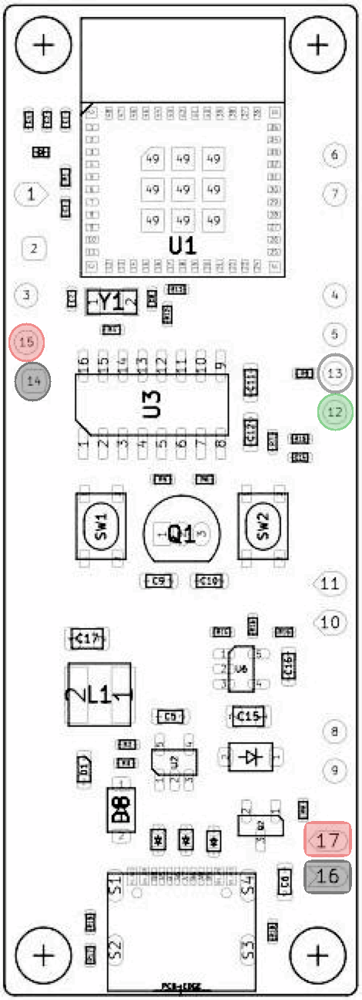

# Crimpdeq V1 Assembly

This chapter explains how to assemble your own Crimpdeq V1 using the custom PCB and the custom 3D-printed case.

## 1. Required Materials
- [Crimpdeq PCB v1.0.0](https://github.com/crimpdeq/crimpdeq-pcb/releases/tag/v1.0.0)
- [Crimpdeq 3D case](https://github.com/crimpdeq/crimpdeq-case/releases/latest)
- Load cell: you can salvage it from a [crane scale](https://www.aliexpress.com/item/1005002719645426.html) ([Amazon alternative](https://www.amazon.es/dp/B08133JCM6)) or buy the load cell directly.
  - It should be a WH-C07 (or a compatible load cell with similar dimensions).
- [2000mAh battery](https://www.aliexpress.us/item/3256809404408618.html?spm=a2g0o.order_list.order_list_main.5.1406194d6kJ2h0&gatewayAdapt=glo2usa4itemAdapt)
- [KCD11 switch](https://www.aliexpress.us/item/2255800787248498.html?spm=a2g0o.order_list.order_list_main.11.1406194d6kJ2h0&gatewayAdapt=glo2usa4itemAdapt)
- 4 x M2.5 screws

## 2. Soldering
1. Connect the load cell to the PCB:
   - Solder the four load cell wires to the PCB. Typical color mapping:

   | **PCB Pin** | **Load Cell Pin** | **Description**                    |
   | ----------- | ----------------- | ---------------------------------- |
   | E+ (15)     | E+ (Red)          | Excitation positive (to load cell) |
   | E- (14)     | E- (Black)        | Excitation negative (to load cell) |
   | S+ (12)     | S+ (Green)        | Signal positive (from load cell)   |
   | S- (13)     | S- (White)        | Signal negative (from load cell)   |

   

   <!-- To get this image:PCB Editor>File>Plot>Select "F.Fab"> Select "Sketch pads on fabricaton layers" and "Inclode pad numbers">Plot -->
2. Connect the battery and switch to the PCB:
   1. Solder the battery negative wire (black) to the `B-` pin on the PCB.
   2. Cut the battery positive wire (red) in half.
   3. Solder one half of the positive wire to one terminal of the KCD11 switch.
      - Route the wire through the switch opening in the case before soldering, because the switch will be installed there later.
   4. Solder the other half of the positive wire from the second switch terminal to the `B+` pin on the PCB.

## 3. Place the Components
1. Place the load cell in the 3D case.
2. Place the battery in the 3D case.
3. Place the PCB in the case.
4. Insert the switch into the switch opening.

## 4. Close the Case
1. Place the lid on the main enclosure.
2. Fasten it with the 4 M2.5 screws.

## 5. Next Steps

1. Flash the firmware (see [Firmware](../../firmware/index.md)).
2. Calibrate the device (see [Calibration](../../calibration/index.md)).
