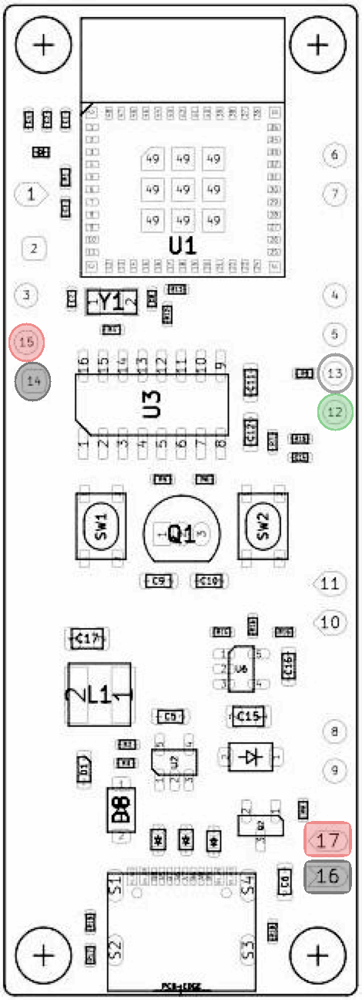
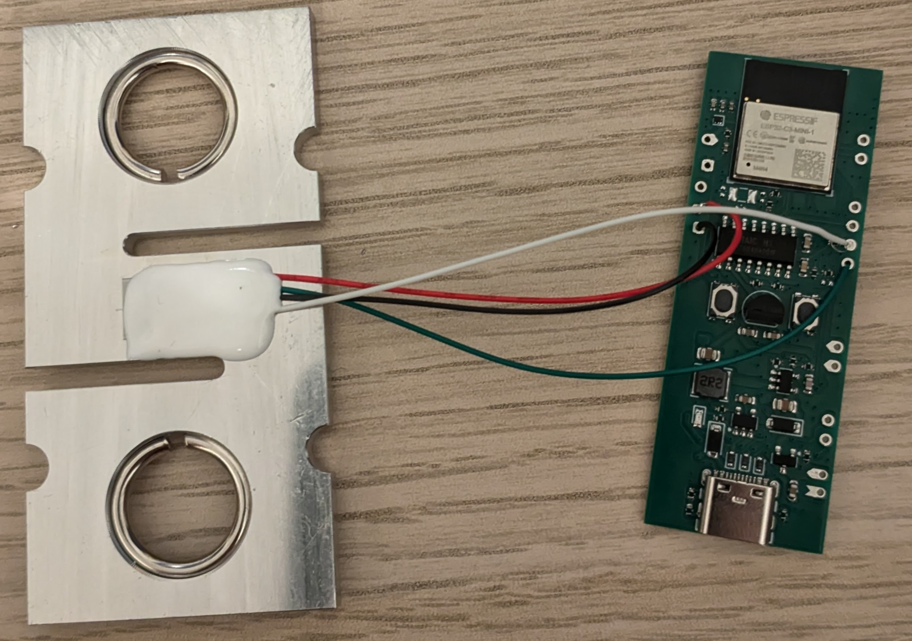
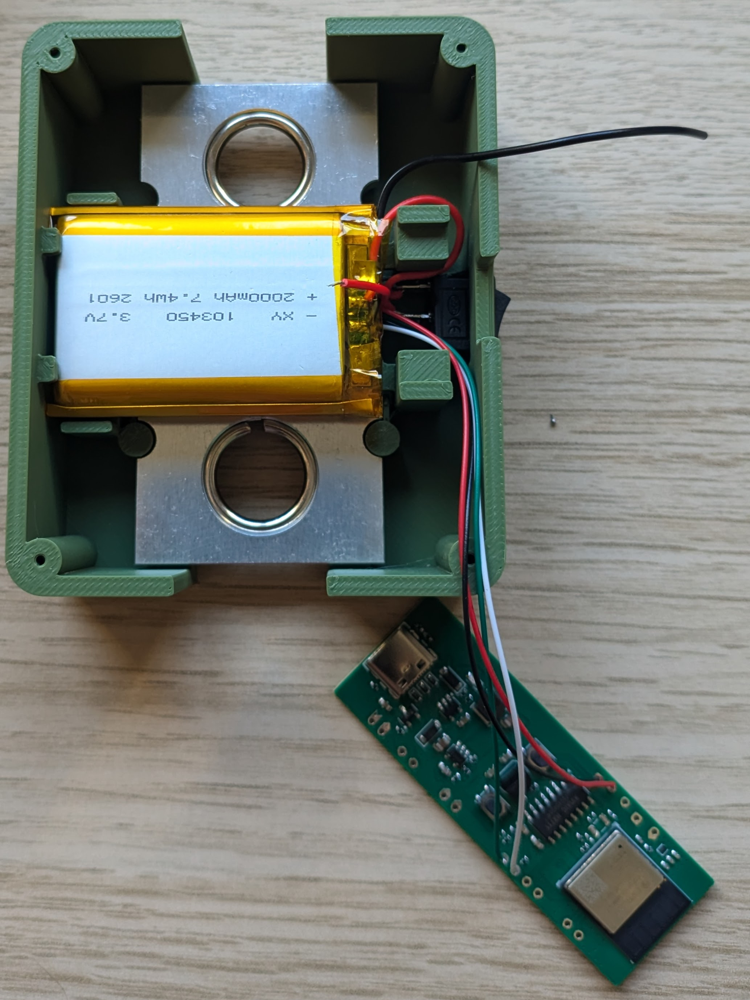
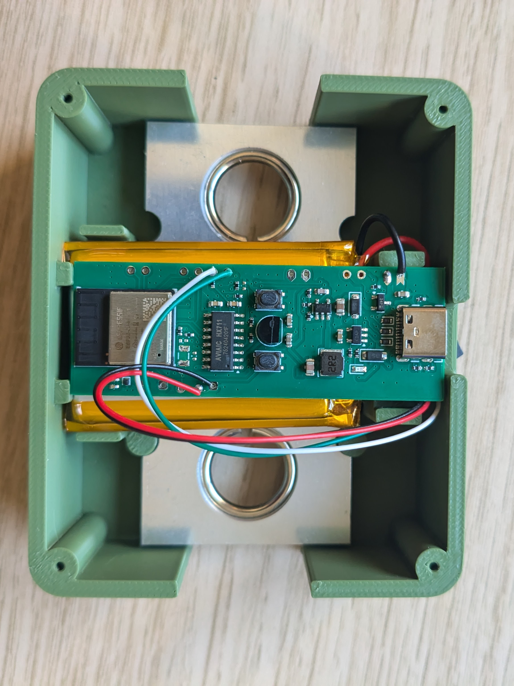

# Crimpdeq Assembly

This chapter shows how to assemble a Crimpdeq using the custom PCB and 3D-printed case.

Most assembly steps are the same for PCB V1 and PCB V2. The main difference is the external wiring pad layout, especially the battery/switch wiring.

## 1. Gather Parts and Tools

### Parts

- [Crimpdeq PCB](https://github.com/crimpdeq/crimpdeq-pcb/releases/latest)
  - See the [PCB manufacturing guide](./pcb.md#how-to-manufacture) if you need to order one.
- [Crimpdeq 3D-printed case](https://github.com/crimpdeq/crimpdeq-case/releases/latest) that matches your PCB revision
- WH-C07 load cell, or a compatible load cell with similar dimensions
  - You can salvage one from a [crane scale](https://www.aliexpress.com/item/1005002719645426.html) ([Amazon alternative](https://www.amazon.es/dp/B08133JCM6)) or buy it separately.
- [3.7 V, 2000 mAh LiPo battery](https://www.aliexpress.us/item/3256809404408618.html?spm=a2g0o.order_list.order_list_main.5.1406194d6kJ2h0&gatewayAdapt=glo2usa4itemAdapt)
- [KCD11 two-terminal switch](https://www.aliexpress.us/item/2255800787248498.html?spm=a2g0o.order_list.order_list_main.11.1406194d6kJ2h0&gatewayAdapt=glo2usa4itemAdapt)
- Insulated hookup wire and heat-shrink tubing
- 4 × M2.5 screws

### Tools

- Soldering iron and solder
- Wire cutters and strippers
- Multimeter

## 2. Identify Your PCB Layout

Before soldering, identify which PCB layout you have and follow the matching wiring table.

| PCB V1 | PCB V2 |
| --- | --- |
|  |  |
| The load cell uses numbered pads `12`–`15`; the battery uses `16` and `17`. | The load-cell and power pads are labeled `E+`, `E-`, `A-`, `A+`, `VBAT`, and `SW+`. |

The assembly photos in this chapter show a V1 PCB. Use the table below—not the wire positions in the photos—to connect a V2 PCB.

## 3. Solder the Connections

> ⚠️ **Battery safety**: Keep USB power disconnected while wiring. Prevent the battery leads from touching each other, and insulate every splice and switch terminal with heat-shrink tubing. Complete the unpowered checks below before connecting either battery lead.

### Load cell

| Function            | Typical wire color | PCB V1 pad | PCB V2 pad |
| ------------------- | ------------------ | ---------- | ---------- |
| Excitation positive | Red                | `E+ (15)`  | `E+`       |
| Excitation negative | Black              | `E- (14)`  | `E-`       |
| Signal positive     | Green or blue      | `S+ (12)`  | `A+`       |
| Signal negative     | White              | `S- (13)`  | `A-`       |

> ⚠️ **Note**: Wire colors are not guaranteed. Confirm the labels or documentation for your load cell before soldering.

Reference photo of the load cell wires after soldering them to a V1 PCB:

### Battery and switch

Before soldering the switch terminals, feed both switch wires from inside the case through the switch opening and slide heat-shrink tubing onto them. Solder the switch outside the case; you will press it into the opening later. Do not attach the switch before feeding the wires through the opening.

Leave both battery leads disconnected until instructed to connect them below.

#### PCB V1

1. Solder a wire from `B+ (17)` to either switch terminal.
2. Leave the other switch terminal available for the battery positive wire.

The completed circuit will place the switch in series with the positive lead: `battery + → switch → B+ (17)`.

#### PCB V2

1. Solder a wire from `SW+` to either switch terminal.
2. Connect the other switch terminal to `VBAT` with a short jumper.
3. Plan the shared `E-` connection for the load-cell and battery negative wires.
   - If both wires do not fit cleanly in the pad, make a short insulated pigtail from `E-` with one branch for each wire.

The completed connections will be:

- `battery + → VBAT`
- `VBAT → switch → SW+`
- `battery − → E-`

> ⚠️ **Important V2 difference**: Unlike V1, V2 keeps `VBAT` connected to the battery while the switch is off. This allows the battery to charge while the device is off. Do not place the switch between the battery and `VBAT`.

### Check before connecting the battery

With both battery leads still disconnected, use a multimeter in continuity or resistance mode to check that:

- Battery positive is not shorted to ground (`B+` to `B-` on V1, or `VBAT` to `E-` on V2).
- Each load-cell wire reaches the correct pad for your PCB revision.
- The switch opens and closes the positive path.
  - On V1, check between the free switch terminal and `B+`.
  - On V2, check between `VBAT` and `SW+`.

Resolve any unexpected short or open connection before proceeding.

### Connect the battery

- **PCB V1:** connect battery positive (red) to the free switch terminal, then connect battery negative (black) to `B- (16)`.
- **PCB V2:** connect battery negative (black) to the shared `E-` connection, then connect battery positive (red) to `VBAT`.

## 4. Install Everything in the Case

1. Place the load cell in its position in the 3D-printed case.
2. Route the load cell wires so they are not pinched by the PCB or the lid.
3. Place the battery in the battery compartment.

4. Position the PCB in the case.
5. Tuck the wires neatly around it so nothing sits under the board.
6. Insert the KCD11 switch into the switch opening.

## 5. Verify the Powered Wiring

With USB still disconnected, use the multimeter in DC voltage mode to confirm the polarity and switch behavior:

- **PCB V1:** place the black probe on `B-` and the red probe on `B+`. The meter should show battery voltage only while the switch is on.
- **PCB V2:** place the black probe on `E-`. With the red probe, confirm that `VBAT` always shows battery voltage and `SW+` shows battery voltage only while the switch is on.

Turn the switch off before closing the case.

## 6. Close the Case

1. Place the lid on the main enclosure.
2. Fasten it with the 4 × M2.5 screws.

## 7. Next Steps

1. Flash the firmware (see [Firmware](../../firmware/index.md)).
2. Calibrate the device (see [Calibration](../../calibration/index.md)).
