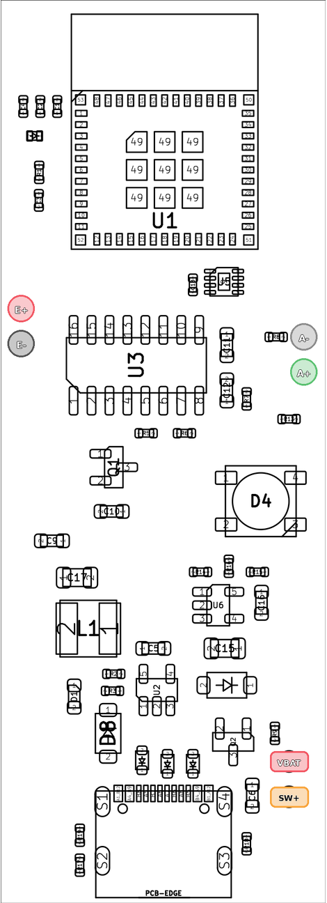

# PCB Design

The PCB design is maintained in the [`crimpdeq-pcb` repository](https://github.com/crimpdeq/crimpdeq-pcb) and was created with KiCad.

It is a two-layer board derived from the [ESP32-C3-DevKit-RUST-1](https://github.com/esp-rs/esp-rust-board). It removes unused sensors from the original design and keeps the components needed by Crimpdeq.

## Revision 2 (Current)

Revision 2 adds clearly labeled external wiring pads, a power path that supports charging while switched off, a battery gauge, and an RGB LED. Its battery and switch wiring differs from Revision 1; follow the [assembly guide](./index.md#battery-and-switch).

## Revision 1

Revision 1 has been tested and works as expected. Its external connections use numbered pads, as shown below.

The PCB was sponsored by [PCBWay](https://www.pcbway.com/). Working with them was fast and easy, and the resulting boards are high quality.

You can find the schematic, layout, and production files for the current revision in the [latest GitHub release](https://github.com/crimpdeq/crimpdeq-pcb/releases/latest). Older revisions are available from the [release archive](https://github.com/crimpdeq/crimpdeq-pcb/releases).

## How to Manufacture
There are two ways to order this PCB:

1. **Using the PCBWay Project page** — recommended, since it already includes the latest uploaded production files.
2. **Placing your own PCBWay order** using the production files from the repository releases.

### Using PCBWay Projects
1. Open the PCBWay Project page using the button below.

   

2. Confirm that the revision shown on the project page is the one you want to build.
3. On the right panel, select **PCB+Assembly** and click **Add to Cart**.
4. Enter the desired quantity and click **Calculate**.

   > ⚠️ **Note**: PCBWay shows two quantity fields. One is the number of PCBs to manufacture, and the other is the number of boards to assemble with components. The minimum PCB quantity is usually 5.

5. Choose your shipping country and shipping method.
6. Click **Save to Cart** to continue with checkout.

### Placing Your Own Order on PCBWay
1. Download the production files from the [latest GitHub release](https://github.com/crimpdeq/crimpdeq-pcb/releases/latest).
2. Use the included files when creating your PCBWay order:
   - `gerber.zip`: PCB fabrication files
   - `bom.csv`: bill of materials for assembly
   - `positions.csv`: component placement file for assembly
3. Submit the order and wait for the manufacturer review.

   - The manufacturer may contact you with questions about substitutions, assembly notes, or file interpretation.

> ⚠️ **Note**: If the manufacturer contacts you with questions or suggestions and you are unsure how to answer, feel free to email me at sergio.gasquez@gmail.com.
