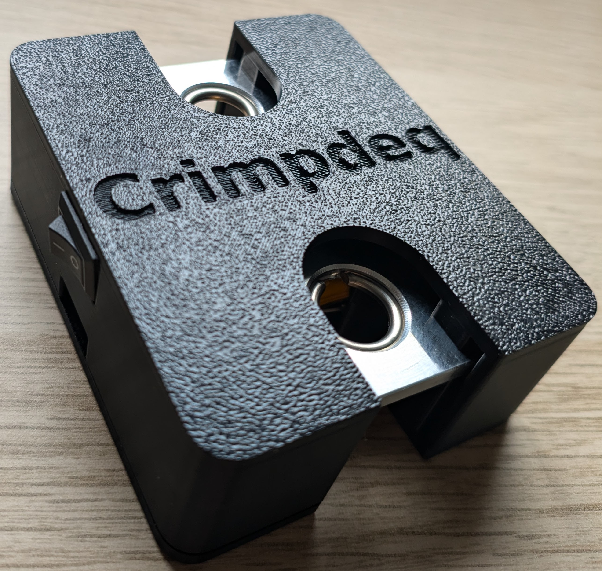

# Build Your Crimpdeq

This chapter presents the two Crimpdeq models you can build.

Choose the one that matches your tools, budget, and how much assembly work you want to do.

## Crimpdeq V1

This model uses a custom PCB and a custom 3D-printed case.

It is the cleanest and easiest version to assemble, and the final result is more compact and polished. See the [PCB details](../pcb.md) and [3D case details](../case.md) for design details.

Follow the [Crimpdeq V1](./crimpdeq_v1.md) assembly guide to build this model!

## Prototype

This model reuses a crane scale case and combines off-the-shelf modules (ESP32-C3 Rust Board + HX711).

It requires more soldering and manual assembly, but it can be cheaper because it does not require manufacturing a custom PCB or a custom 3D case, which usually makes it cheaper!

Follow the [Prototype Version](./prototype.md) assembly guide to build this model!
