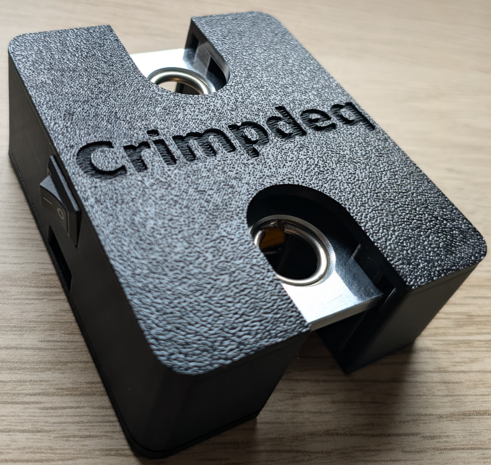

# Build Your Crimpdeq

This chapter presents the Crimpdeq models you can build.

Choose the one that matches your tools, budget, and how much assembly work you want to do.

## Crimpdeq PCB Build

This model uses a [custom PCB](./crimpdeq/pcb.md) and a [custom 3D-printed case](./crimpdeq/case.md).

It is the cleanest and easiest version to assemble, and the final result is more compact and polished. The assembly guide covers both PCB V1 and PCB V2, including their wiring differences.

Follow the [Crimpdeq Assembly](./crimpdeq/index.md) guide to build this model.

## Prototype

This model reuses a crane scale case and combines off-the-shelf modules (ESP32-C3 Rust Board + HX711).

It requires more soldering and manual assembly, but it can be cheaper because it does not require manufacturing a custom PCB or 3D-printed case.

Follow the [Prototype Assembly](./prototype.md) guide to build this model.
